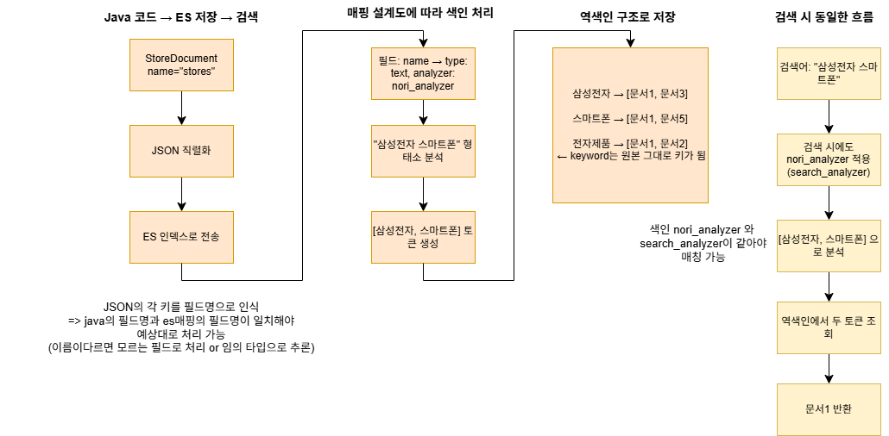
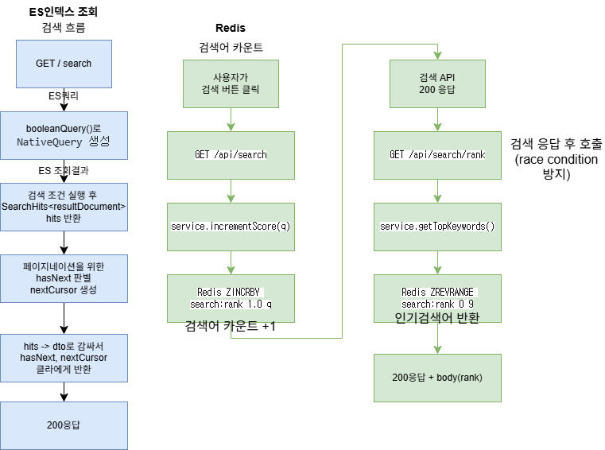
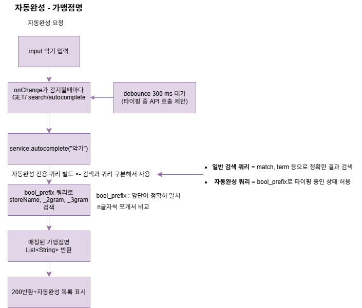

# 흐름도

- **es 매핑과 색인**

  

---

- **es 통합검색 + Redis 인기검색**

  

---

- **Redis 자동완성**

  

---

# 설계전략

## RDB - ES 관계
- RDB의 `id(PK)` 값을 ES의 `storeId(keyword)`에 동일하게 저장
- 검색은 ES에서, 상세 조회/연산은 RDB에서 처리
- ES 검색 결과의 `storeId`로 RDB 조회

## id 설계 
- ES `_id`는 메타필드로 정렬 불가 → 커서 페이징 보조 정렬키로 사용 불가
- `storeId(keyword)` 를 별도 필드로 저장 → 정렬 + RDB 연결 두 역할 담당

| | 필드 | 타입 | 역할 |
|--|------|------|------|
| ES | `_id` | 메타필드 | ES 문서 식별 (정렬 불가) |
| ES | `storeId` | keyword | RDB 연결 + 커서 정렬키 |
| RDB | `id` | PK | storeId와 동일한 값 |

## 커서 페이징
- offset 페이징은 데이터가 많을수록 성능 저하 → 커서 페이징 채택
- 기본 정렬키 : `_score` (검색 연관도)
- 보조 정렬키 : `storeId` (동점일 때 순서 보장 + RDB 연결)
- 다음 페이지 있을 때만 nextCursor 생성 (없으면 null)
  - lastHit → encodeCursor() → url로 전달

 
## 검색
- "storeName^3","address^1","category^2" : 필드 가중치 정렬
- "sido","category","bank" : 필터
- filter : ["nori_part_of_speech"] => 조사 삭제

## 자동완성
> search_as_you_type (ES 전용 타입)
- 선택 이유 :  Edge NGram과 Redis로 구현하는 대안도 있었으나,
search_as_you_type + mixed 충돌 => search_as_you_type + discard로 변경

## 북마크 ES 연동 전략

### 즉시 반영 (메인)

북마크 추가/삭제 시:
1. ES의 `storeId` 필드로 RDB 조회 → DB 저장/삭제
2. ES의 `_id`로 조회 → `bookmarkCount` 즉시 +1/-1

> ES 업데이트 실패 시 warn 로그만 남기고 예외 전파 X
> → 배치 스케줄러가 보정해주므로 사용자에게 에러 응답 불필요

### 배치 보정 (보험)

매일 새벽 3시:
1. DB에서 `storeId` 기준 `COUNT GROUP BY` 집계
2. ES document에 집계값 덮어쓰기로 정합성 보정

## 참고

- RDB 조회 시 기본키(PK) 사용 → 자동 인덱스로 가장 빠른 조회

- ES `_id` = DB `storeId`를 String으로 변환한 값
  - reindex 후에도 항상 동일하게 유지
  - `_id` 고정이 필요한 경우:
    - 외부(RDB 등)에서 `_id`를 참조하는 경우
    - `_id`로 document를 직접 업데이트해야 하는 경우 (북마크 카운트 등)
  - `_id` 미고정 시: reindex마다 랜덤 UUID 생성 → 기존 참조값 무효화

- `bookmarkCount`는 ES에 숫자만 저장
  - 실제 북마크 데이터는 RDB가 source of truth (진실의 원천)
  - ES 업데이트 실패 → RDB 기준으로 배치가 보정
